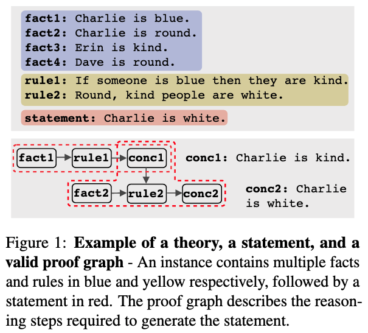
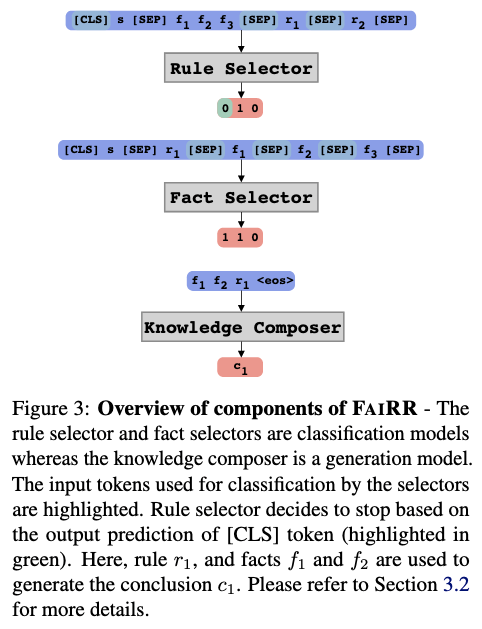

# FaiRR: Faithful and Robust Deductive Reasoning over Natural Language [[paper]](https://arxiv.org/abs/2203.10261)

<p align="center">
  
</p>

Above figure shows an example of the deductive reasoning task that we aim to solve using our modular reasoning model FaiRR.

<p align="center">
  
</p>

Above figure depicts the overview of the FaiRR architecture which comprises of 3 independent modules.

### Dependencies

- Dependencies can be installed using `requirements.txt`.

### Pipeline for running FaiRR

- Download the Proofwriter dataset 
```bash
wget https://aristo-data-public.s3.amazonaws.com/proofwriter/proofwriter-dataset-V2020.12.3.zip
```

- In your current directory (directory of this repository/code), run the following commands to make relevand data directories and to copy data in those directories
```bash
# make data directories
mkdir ../data
mkdir ../data/raw/

# Unzip proofwriter data in ../data/raw/
unzip <path to downloaded proofwriter dataset zip file> -d ../data/raw/

# rename the proofwriter data directory
mv ../data/raw/proofwriter-dataset-V2020.12.3 ../data/raw/proofwriter

# make directory for saving models
mkdir ../saved
```

- After setting up the data as described above, we can preprocess the datasets, train individual modules, followed by evaluation using the following commands
```bash
# make data for training ruleselector
python process_proofwriter.py --dataset pwq_leq_0to3 --fairr_model fairr_rule --arch roberta_large

# train ruleselector model
python main.py --override fairr_ruleselector,pwq_leq_0to3_OWA_rule

# make data for training factselector
python process_proofwriter.py --dataset pwq_leq_0to3 --fairr_model fairr_fact --arch roberta_large

# train factselector model
python main.py --override fairr_factselector,pwq_leq_0to3_OWA_fact

# make data for training reasoner
python process_proofwriter.py --dataset pw_leq_0to3 --fairr_model fairr_reasoner --arch t5_large

# train reasoner model
python main.py --override fairr_reasoner --dataset pw_leq_0to3_OWA_reasoner

# make the inference data (using unstaged files obtained from ProofWriter paper)
python process_proofwriter.py --dataset pwu_leq_3
# Note: using the above command, the D3 data will be generated for evaluation

# evaluate the model checkpoints from above using the inference pipeline
python main.py --override fairr_inference,evaluate --dataset pwu_leq_3_OWA --ruleselector_ckpt <path_to_trained_checkpoint> --factselector_ckpt <path_to_trained_checkpoint> --reasoner_ckpt <path_to_trained_checkpoint>
```

A sample command to evaluate the model using the trained checkpoints would look like as follows (checkpoint paths are for illustration purposes):
```bash
python main.py --override fairr_inference,evaluate --dataset pwu_leq_3_OWA --ruleselector_ckpt ../saved/fairr_ruleselector_pwq_leq_0to3_OWA_rule_roberta_large_15_03_2022_2cfba9a2/checkpoints/epoch\=1-step\=19.ckpt --factselector_ckpt ../saved/fairr_factselector_pwq_leq_0to3_OWA_fact_roberta_large_15_03_2022_7ac436c2/checkpoints/epoch\=0-step\=9.ckpt --reasoner_ckpt ../saved/fairr_reasoner_pw_leq_0to3_OWA_reasoner_t5_large_15_03_2022_751db777/checkpoints/epoch\=1-step\=19.ckpt
```

The above commands would train and evaluate models using the D0-3 data and D3 data respectively. Similar to this, the commands can be changed for other datasets. For example, if we need to train models using D3 data, replace "D0to3" with "D3" in the above commands (some configuration files need to be created as well under `configs/dataset/`). Please note that these runs are configured to run on RTX-8000 machines with 48Gb GPU memory. In case of smaller GPUs, the train batch size, eval batch size, and gradient accumulations can be changed using the commandline args `--train_batch_size`, `--eval_batch_size`, and `--accumulate_grad_batches` respectively.


- To evaluate the robustness of the models, first we create an equivalence set of theories by replacing names/attributes by OOD samples. The command for creating the robustness datasets and evaluating trained models as as follows:
```bash
# make the subject(name) robustness dataset (raw test file)
python utils/fact_augmentation.py --split test --dataset depth-3 --names

# process the raw test file (note we are doing it for the proof-depth == 2 datapoints of the depth-3 dataset. So x can be 0,1,2,3,100(==N/A datapoints)in pwur_leq_3_eq_<x>_name below. Please refer to the paper for more details.)
python process_proofwriter.py --dataset pwur_leq_3_eq_2_name --fairr_model fairr_rule --arch roberta_large

# evaluate the model checkpoints using the inference pipeline, on the dataset created above
python main.py --override fairr_inference,evaluate --dataset pwur_leq_3_eq_2_name_OWA --ruleselector_ckpt <path_to_trained_checkpoint> --factselector_ckpt <path_to_trained_checkpoint> --reasoner_ckpt <path_to_trained_checkpoint>
```

Please create an issue or contact [Soumya](https://soumyasanyal.github.io/) for any clarifications or suggestions.
